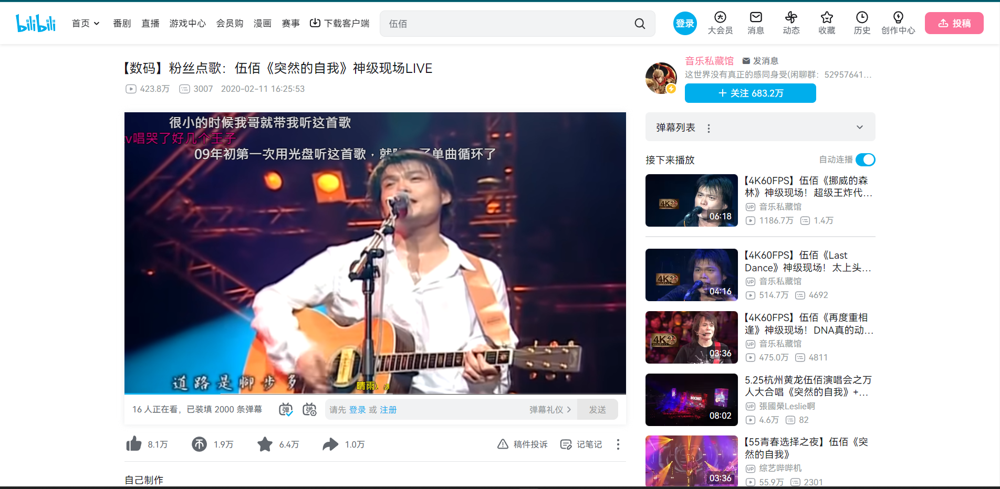
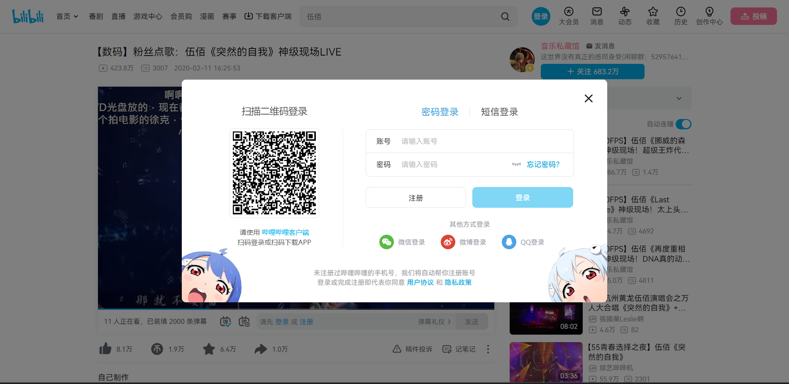

# bilibili-never-stop
bilibili will never stop in the background
# 介紹
Bilibili 是一個我很喜歡的播放平台，相較於 Youtube的影片都只能在下方留言，Bilibili上面的彈幕可以即時看到片段人家分享的心得或感受。所以一樣的影片在 Youtube上看過後，會再去 Bilibili 找一樣或差不多的影片看大家的心得。

可是某一次改版後，似乎沒有登入帳號的使用者在播放到一半就會彈出視窗把影片停下來，請你登入會員，必須要把視窗點掉後，再按播放影片。播放一支影片彈出一次，比 Youtube 廣告播完後會繼續自動播放還要惱人，因此自己做了一個擴充套件，在影片彈出視窗後，自動關閉視窗並且自動繼續播放影片

看伍佰突然的自我的影片看到一半突然被停下來

# 原理
原理很簡單，只用幾行 Javascript 就實現本功能。在進入 Bilibili 網站的時候，擴充套件會自動抓取並監聽頁面上的 Video 元素。一旦 Video 元素被停止播放，套件會將彈出來的視窗元素刪掉，並且強制播放影片。